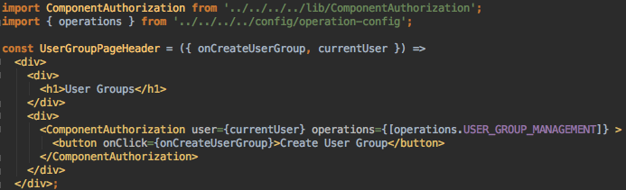

## DOES QCLOUD NEED GRAPHQL?

Thoughts after the Apollo spike

---
#### PAINS WITH REDUX


- Complexity
- Boilerplate
- Indirection
---
#### PAINS WITH ~~REDUX~~ REST


- Complexity
- Boilerplate
- **Indirection**
---



Should `UserGroupsPageHeader` display

the Create User Group button?

---

#### THE BUSINESS RULE

The Create User Group button should be displayed 

if the current user is allowed to create user groups.


#### WHAT THE CLIENT WANTS TO ASK THE SERVER

Is the current user allowed to create user groups?

---
#### WHAT ACTUALLY HAPPENS

---

#### #1

`UserContainer`

requests the current user from the server.

---
```json
{
  "allowedOperations": [
    "review_sheets",
    "user_management"
  ],
  "companyId": 1,
  "createdAt": "2017-08-16T03:15:20.821+05:30",
  "email": "qcloudmanager@nulogy.com",
  "id": 2,
  "name": "QCloud Manager",
  "role": "manager",
  "timeZone": "Sri Jayawardenepura",
  "updatedAt": "2018-10-25T00:50:45.250+05:30",
  "userGroupId": 6
}
```
the [truncated] payload

---
#### #2
`UserContainer`

passes `currentUser` 
to `UserGroupPageHeader`.

---
#### #3
`UserGroupPageHeader` 

gets the User Group Management 
operation from the operation config.

---
#### #4
`UserGroupPageHeader` 

passes `currentUser`
and the operation to `ComponentAuthorization`.

---

#### #5
`ComponentAuthorization` 

passes `currentUser`
and the operation to `StandardPolicy`.

---

#### #6
`StandardPolicy`

iterates through `user.allowedOperations` and 
authorizes if `allowedOperations` contains the operation.

---
#### #7
`StandardPolicy`

checks `user.role` and authorizes the component 
if the role is 'administrator'.

---
#### #8
`ComponentAuthorization`

displays the button if authorized and hides it if not.

---
```json
{
  "allowedOperations": [
    "review_sheets",
    "user_management"
  ],
  "companyId": 1,
  "createdAt": "2017-08-16T03:15:20.821+05:30",
  "email": "qcloudmanager@nulogy.com",
  "id": 2,
  "name": "QCloud Manager",
  "role": "manager",
  "timeZone": "Sri Jayawardenepura",
  "updatedAt": "2018-10-25T00:50:45.250+05:30",
  "userGroupId": 6
}
```
@[2-5, 11]
---
What if...


```json
{
  "allowedOperations": [
    "review_sheets",
    "user_management"
  ],
  "role": "manager"
}
```

---

```graphql
query GetOperationsAndRole {
    user {
        allowedOperations,
        role
    }
}

```
It's more efficient, but...

---
```graphql
query GetOperationsAndRole {
    user {
        allowedOperations,
        role
    }
}

```
It's more efficient, but...
not good enough.

---

The client still needs to know how to take `allowedOperations`
and `role` and compute the answer to its question.

---

"Is the current user allowed to create user groups?"

We can't ask our REST API this question directly,
and we can't fix this with client-side GraphQL alone.

---

"Is the current user allowed to create user groups?"

```graphql
query CanUserCreateUserGroups {
    user {
        canCreateUserGroups
    }
}
```

---


